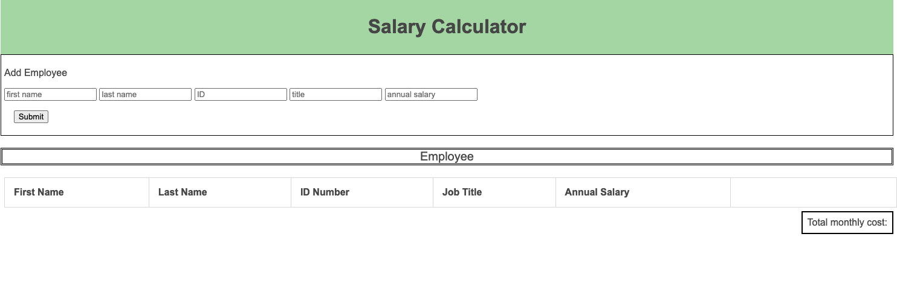
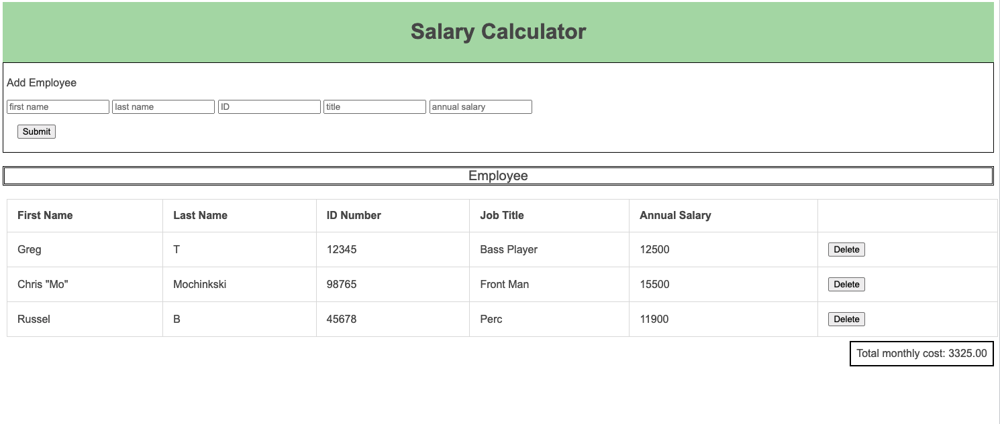
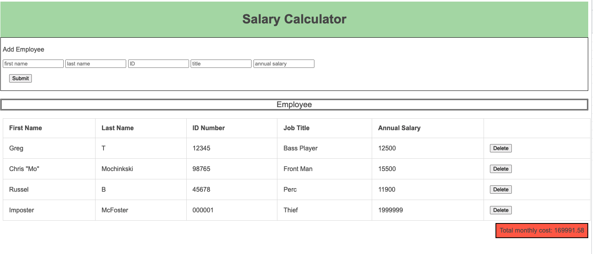

# Salary Calculator

## Description
_Duration: 48 hours_

I built a table to receive information from an employee and store it in a table. The information was then used to calculate total monthly costs for the employer. I had to create input fields to recieve the data, and buttons to capture the data, and, once captured, delete the data if desired. Captured data is calculated and posted under the table as the total. 

---

### Images

Here is an example of the tamble, when empty:

Here is an example of the table with some employees entered:

Here is an an example of going over budget:

## Checklist 

I implemented the following steps to wrrite the code:

- [x] Create our document source files, log "DOM ready"
- [x] Building a template in HTML (alternately work first in JS, appending to dom from there)
- [x] Add some basic style to the table
- [x] Button click that logs to the console
- [x] assign input to variables
- [x] Create a function to append data to DOM
- [x] Global variables for monthly costs
- [x] Append monthly cost to the DOM
- [x] Logic for background color on the monthly cost
- [x] Create delete button that removes a row

### Stretch

- [x] Uptdate the total cost on delete of row
- [x] Arrays and Objects to hold information
- [x] Alert the user of missing fields

## Functions used

-`readyNow`
-`addEmployeeInfo`
-`deleteEmployee`
-`calculateCost`
-`updateCost`

### Acknowledgements

Thanks to my my week one Pod, and Google, and my wife.

Additional README details can be found [here](https://github.com/PrimeAcademy/readme-template/blob/master/README.md).
